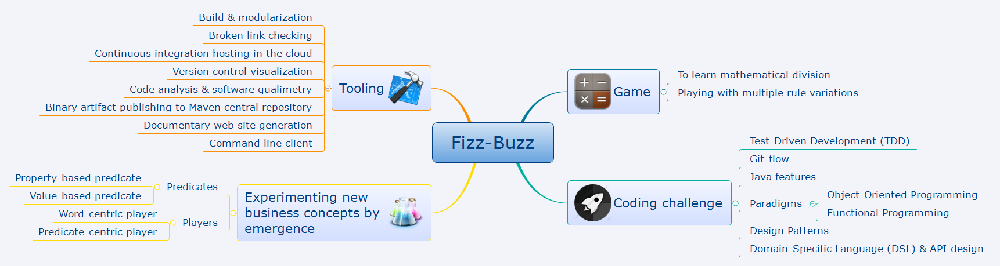
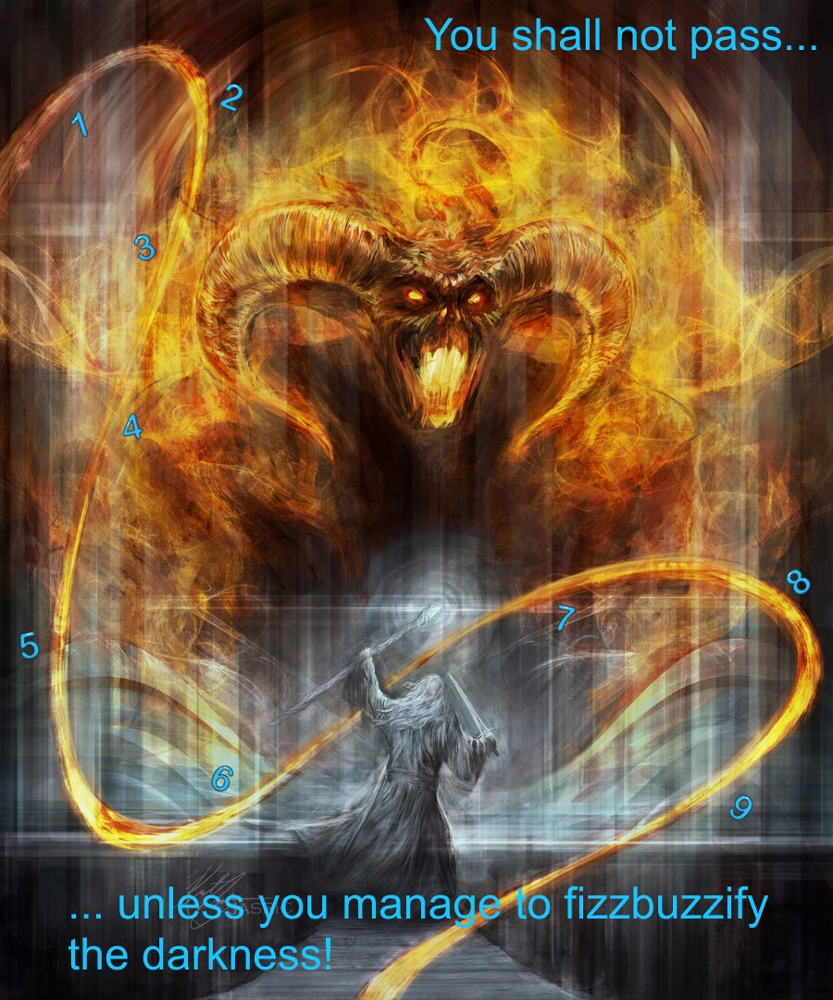
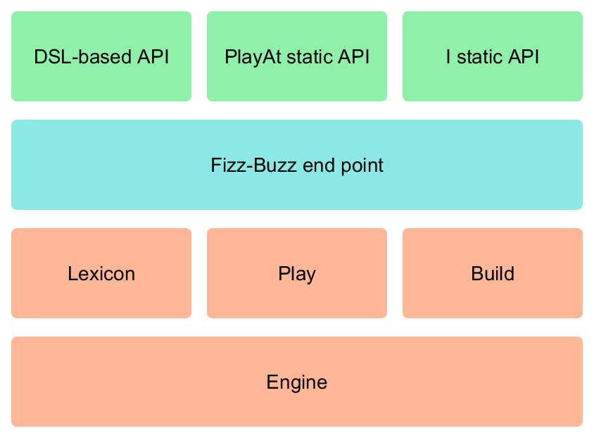

[FizzBuzz](https://en.wikipedia.org/wiki/Fizz_buzz) is originally a game to help kids to learn the mathematical division by playing with numbers. If a number has a given factor, it is replaced with the matching word: "Fizz" when divisible by 3, "Buzz" when divisible by 5. Later Fizz-Buzz becomes a well-known short programming problem to select developer candidates. Fizz-Buzz is also used as an [icebreaker](https://en.wikipedia.org/wiki/Icebreaker_(facilitation)) for adult groups, in the training, facilitation or [Agile](http://agilemanifesto.org/) background . As I was reading further information about Fizz-Buzz, I realized the problem could be more difficult thanks to many variations, for learning kids as much as for programmers. Thus this game is here an opportunity to play with the Java programming language features as well as some programming paradigms such as the object-oriented and functional ones, while building a fluent API. The whole has been made in the [Test-Driven Development](https://en.wikipedia.org/wiki/Test-driven_development) way and [Git-Flow](http://nvie.com/posts/a-successful-git-branching-model/) is choosen as the version control workflow. 

# Usage

## Fizz-Buzz basics

### Fizz-Buzz of one number

To get the result of Fizz-Buzz for a given number n: `fizzBuzz.of(n)` where `fizzBuzz` is an instance of the `FizzBuzz` class.  
For example: `fizzBuzz.of(3)` returns "Fizz" and `fizzBuzz.of(5)` returns "Buzz".

### Fizz-Buzz of several arbitrary numbers

To get the result of Fizz-Buzz for several given numbers n1, n2, ..., nx: `fizzBuzz.of(n1, n2, ..., nx)`.  
For example: `fizzBuzz.of(3, 5, 15)` returns "Fizz Buzz FizzBuzz".

### Fizz-Buzz of a range of numbers

To get the result of Fizz-Buzz for a given range of numbers: `fizzBuzz.from(start).to(end)`.  
For example: `fizzBuzz.from(1).to(15)` returns "1 2 Fizz 4 Buzz Fizz 7 8 Fizz Buzz 11 Fizz 13 14 FizzBuzz".

Notice that the start and end numbers are *inclusive*.

## More rules

### Fizz-Buzz variations

You can choose the game rules to be applied. The followings ones are popular variations.
- **Classic Fizz-Buzz**: `fizzBuzz.whenNumberHasFactors()` is the rule by default. `fizzBuzz.whenNumberHasFactors().of(n)` has the same result than `fizzBuzz.of(n)`.
- **Variation according to digits**: `fizzBuzz.whenNumberContainsDigits()` is a variation according to the digits contained by a given number, that is to say any number containing the 3 or 5 digit is replaced respectively with "Fizz" and "Buzz". For example: `fizzBuzz.whenNumberContainsDigits().from(1).to(15)` returns "1 2 Fizz 4 Buzz 6 7 8 9 10 11 12 Fizz 14 Buzz" and `fizzBuzz.whenNumberContainsDigits().of(35)` returns "FizzBuzz".
- **7Boom**: `fizzBuzz.boom()` is a variation to replace any number containing or divisible by 3, 5 or 7 with "Fizz", "Buzz" and "Boom". For example: `fizzBuzz.boom().from(1).to(15)` returns "1 2 Fizz 4 Buzz Fizz Boom 8 Fizz Buzz 11 Fizz Fizz Boom FizzBuzz" and `fizzBuzz.boom().of(7539)` returns "FizzBuzzBoom".
- **Fizz-Buzz-Woof**: `fizzBuzz.woof()` is a variation to replace any number containing or divisible by 3, 5 or 7 with "Fizz", "Buzz" and "Woof", repeated as many times as the condition is true. For example: `fizzBuzz.woof().from(1).to(15)` returns "1 2 FizzFizz 4 BuzzBuzz Fizz WoofWoof 8 FizzFizz Buzz 11 Fizz Fizz Woof FizzBuzzBuzz" and `fizzBuzz.woof().of(35)` returns "FizzBuzzBuzzWoof".
- **Fizz-Buzz-Pop-Whack**: `fizzBuzz.popWhack()` is a variation to replace any number divisible by 3, 5, 7 or 11 with "Fizz", "Buzz", "Pop" and "Whack" respectively. For example: `fizzBuzz.popWhack().from(1).to(15)` returns "1 2 Fizz 4 Buzz Fizz Pop 8 Fizz Buzz Whack Fizz 13 Pop FizzBuzz" and `fizzBuzz.popWhack().of(1155)` returns "FizzBuzzPopWhack".
- **Fizz-Buzz-Pop-Whack-Zing-Chop**: `fizzBuzz.popWhackZingChop()` is a variation to replace any number divisible by 3, 5, 7, 8 , 11 or 13 with "Fizz", "Buzz", "Pop", "Zing", "Whack" and "Chop" respectively. For example: `fizzBuzz.popWhackZingChop().from(1).to(15)` returns "1 2 Fizz 4 Buzz Fizz Pop Zing Fizz Buzz Whack Fizz Chop Pop FizzBuzz" and `fizzBuzz.popWhackZingChop().of(120120)` returns "FizzBuzzPopWhackZingChop".

### Fizz-Buzz in various manners

You can invoke the Fizz-Buzz variations with a more concise syntax, thanks to *static* methods provided by the `PlatAt` and `I` classes. The `PlayAt` class proposes all the known Fizz-Buzz variations by naming them, while the `I` class do the same thing by variation-based verbs.  
For example with the `PlatAt` class: `fizzBuzz()` is to play at Fizz-Buzz, `sevenBoom()` at 7Boom, `fizzBuzzWoof()` at Fizz-Buzz-Woof, `fizzBuzzPopWhack()` at Fizz-Buzz-Pop-Whack and `fizzBuzzPopWhackZingChop()` at Fizz-Buzz-Pop-Whack-Zing-Chop.  
For example with the `I` class: `fizzbuzzify(values)` transforms `values` according to the Fizz-Buzz rules, while `fizzbuzzify(start).until(end)` transforms the numbers between the `start` and `end`values. The same principle is applied to all variations: `sevenboomify`, `fizzbuzzwoofify`, `fizzbuzzpopwhackify`, `fizzbuzzpopwhackzingchopify`.

### Combining some Fizz-Buzz variations

You can combine some variation rules to be applied by chaining the corresponding methods.  
For example: `fizzBuzz.whenNumberHasFactors().whenNumberContainsDigits().of(3, 5, 15, 30, 315)` returns "FizzFizz BuzzBuzz FizzBuzzBuzz FizzFizzBuzz FizzFizzBuzzBuzz".

Notice that the variation rules are applied according to the Fizz-Buzz order: Fizz at first, Buzz after. Also notice that each time a condition is satisfied the matching word is repeated. If you will not, as playing at 7Boom, you can specify it: `fizzBuzz.wordsOnlyOnce().whenNumberHasFactors().whenNumberContainsDigits().of(55)` returns "Buzz" only, instead of "BuzzBuzz". On the contrary, if you wish a word was repeated as many times as a condition is true, you can also specify it: `fizzBuzz.wordsNTimes().whenNumberHasFactors().whenNumberContainsDigits().of(55)` returns "BuzzBuzzBuzz".

### Playing with custom words

You can specify your own custom words, each associated to one property.  
For example: `fizzBuzz.word("Foo", 3).word("Bar", 5).of(3, 5, 15)` returns "Foo Bar FooBar".

### Playing with custom predicates

You can specify your own custom predicates, to be applied to any numbers: a given number is replaced with a word if the provided predicate is satisfied. Such a predicate checks if a property is applicable to a value. You have to define your predicate by using a Java 8 lambda that returns a boolean: `(value, property) -> { /* TODO: return a boolean */ }`.  
For example: `fizzBuzz.word("Even", 2).whenNumberSatisfies((value, property) -> value % property == 0).from(1).to(4)` returns "1 Even 3 Even". More sophisticated predicate implementations are allowed, like digital sequences, thresholds based on arithmetical calculations, etc.

## More customizations

### FizzBuzz result as a list

You can get a list of words as a Fizz-Buzz result instead of a string of words based on the concatenation. Splitting the string result is no longer needed.  
For example: `fizzBuzz.asList().of(3, 5)` returns `{ "Fizz", "Buzz" }`.

### Separating words while printing

You can print the words being separated by predefined or custom separators. The predefined separators are : comma, semi-colon, slash, backslash, dash, line feed.  
For example: `fizzBuzz.separatedByComma().of(3, 5)` returns "Fizz, Buzz" and `fizzBuzz.separatedBy("-*-").of(3, 5)` returns "Fizz-\*-Buzz".

The word separator can be a predefined or custom punctuation mark. In this case, the all sentence is completed with it. The predefined punctuation marks are : exclamation mark, full stop (period).  
For example: `fizzBuzz.punctuatedByExclamationMark().of(3, 5)` returns "Fizz! Buzz!" and `fizzBuzz.punctuatedBy("?").of(3, 5)` returns "Fizz? Buzz?".

Some French alternatives exist because of one space before some punctuation marks.  
For example: `fizzBuzz.separatedByFrenchSemiColon().of(3, 5)` returns "Fizz ; Buzz" and `fizzBuzz.separatedByFrenchExclamationMark().of(3, 5)` returns "Fizz ! Buzz !".

You can even print the fizzbuzzified numbers between brackets just after the FizzBuzz words.  
For example: `fizzBuzz.separatedByComma().withNumbers().from(1).to(5)` returns "1, 2, Fizz (3), 4, Buzz (5)". 

## More features

### Finding the most Fizzy-Buzzy

You can find the most Fizzy-Buzzy number in some given arbitrary numbers or in a given range of numbers, that is to say the number whose the corresponding expression after being fizzbuzzified contains the greater number of Fizz-Buzz words, such as "Fizz" or "Buzz".  
For example: `fizzBuzz.findTheMostFizzyBuzzy().of(1, 3).asNumber()` returns 3 and `fizzBuzz.findTheMostFizzyBuzzy().from(1).to(15).asNumber()` returns 15.

You can find the most Fizzy-Buzzy expression in some given arbitrary numbers or in a given range of numbers, that is to say the expression that contains the greater number of FizzBuzz words, such as "Fizz" or "Buzz".  
For example: `fizzBuzz.findTheMostFizzyBuzzy().of(1, 3).asWord()` returns "Fizz" and `fizzBuzz.findTheMostFizzyBuzzy().from(1).to(15).asWord()` returns "FizzBuzz".

### Alternating substitution words

You can specify several custom words each associated to the same single property. These words will be alternately substituted for any number satisfying a property-based predicate.  
For example: `fizzBuzz.alternateWords({ "Foo", "Bar" }, 2).from(1).to(6)` returns "1 Foo 3 Bar 5 Foo" and `fizzBuzz.alternateWords({ "Foo", "Bar" }, 3).word("Baz", 5).from(1).to(10)` returns "1 2 Foo 4 Baz Bar 7 8 Foo Baz".

Of course, you can accumulate single words and alternate words into the same way of play.

# Release Notes

## Version 1.6: alternate words

- New end points are proposed to use the Fizz-Buzz features with a more concise syntax. They are aimed at a more simple usage than the complete API.
- One property can be associated to several alternate words. These alternate words are used one after the other to be substituted for numbers.

## Version 1.5: expandable predicates

- Custom property-based predicates can be specified to replace the default ones, that is to say the fact that a number has factors or that a number contains digits.
- As inputs, long integers are also accepted, not only regular integers. In addition to long integers, more inputs are now accepted, like numeric strings or big integers. It lets us play with very big numbers and no limit! This enhancement is complementary to custom predicates.

## Version 1.4: expandable words

- The Fizz-Buzz-Pop-Whack variation is implemented: every number divisible by 7 or 11 is replaced with "Pop" or "Whack" respectively, in addition to the Fizz-Buzz basics.
- The Fizz-Buzz-Pop-Whack-Zing-Chop is implemented: every number divisible by 8 or 13 is replaced with "Zing" or "Chop" respectively, in addition to the Fizz-Buzz-Pop-Whack basics.
- Custom words can be specified instead of the usual "Fizz" and "Buzz" words, and associated to one number.
- The fizzbuzzified numbers can be got as a list of strings, instead of one string.
- It is possible to find the most fizzbuzzified number in some arbitrary numbers or in a range of numbers.
- It is possible to find the most Fizzy-Buzzy word in some arbitrary numbers or in a range of numbers.

## Version 1.3: word repetition by occurrence

- Any specified word can be repeated as many times as a given number has a factor or contains a digit.
- The Fizz-Buzz-Woof variation is implemented: every number divisible by 7 or containing the digit 7 is replaced with "Woof", in addition to the Fizz-Buzz basics, and a word is repeated as many times as one condition is true.

## Version 1.2: word repetition by predicate

- The 7Boom variation is implemented: every number divisible by 7 or containing the digit 7 is replaced with "Boom", in addition to the Fizz-Buzz basics.
- Variation combinations can be played by repeating or not the words each time a number satisfies a condition.
- The words can be printed being separated by predefined separators or custom separators. If the separator is a punctuation mark, the all sentence is completed with it.
- The printed Fizz-Buzz words can be followed by the fizzbuzzified number between brackets.

## Version 1.1: first variation

- Instead of replacing numbers that have 3 or 5 as a factor, the game can be played by replacing numbers containing the digit 3 or 5 with "Fizz" or "Buzz".
- Any number that contains the number or is divisible by that number is replaced by the matching word.

## Version 1.0: basics

- Write a program that prints the numbers from 1 to 100.
- But for multiples of three print “Fizz” instead of the number and for the multiples of five print “Buzz”.
- For numbers which are multiples of both three and five print “FizzBuzz”.

# Software Manufacturing

## Fizz-Buzz Architecture

From the most simple, trivial solution...

<pre style='color:#d1d1d1;background:#000000;'>import static java.util.stream.Collectors.toList;import java.util.stream.IntStream;publicclass FizzBuzz {publicstaticvoid main(String[] args){System.out.println(IntStream.rangeClosed(1,100).mapToObj(value ->{if(value %15==0){return"FizzBuzz";}elseif(value %3==0){return"Fizz";}elseif(value %5==0){return"Buzz";}else{returnString.valueOf(value);}}).collect(toList()));}}</pre>

...to a much more sophisticated, powerful implementation...

<!-- Schema palette: http://colorschemedesigner.com/csd-3.5/#0h31BJaGrlvF9 -->

## Fizz-Buzz Story

<iframe width="560" height="315" src="https://www.youtube.com/embed/E5xPMW5fg48" frameborder="0" allowfullscreen></iframe>
